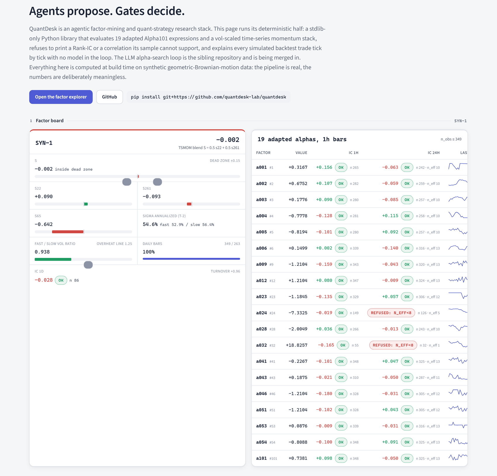

# QuantDesk

**A quant research library that refuses to print numbers it cannot support.**
Pure standard-library Python: 19 adapted formulaic alphas, vol-scaled
time-series momentum, microstructure observables, a Rank-IC research board
with refusal gates, and a fee-first event backtester that explains every
simulated trade tick by tick - with no language model anywhere in the loop.
Nothing here trades.

[](https://github.com/quantdesk-lab/quantdesk/actions/workflows/ci.yml)
[](https://quantdesk-lab.github.io/)


[](https://quantdesk-lab.github.io/)

**Live demo: <https://quantdesk-lab.github.io/>** - the factor board above,
an alpha explorer, a cost-grid backtest with per-tick trade tickets, and an
empirical null band. Every figure is computed at build time on synthetic
geometric-Brownian-motion bars; the `REFUSED` badges are the library
declining to report an IC whose effective sample is too small.

## Thirty seconds

```bash
pip install git+https://github.com/quantdesk-lab/quantdesk     # no dependencies
```

```python
from quantdesk.demo.fixtures import gbm_bars, split_ohlcv
from quantdesk.factors.alpha101 import alpha001
from quantdesk.research.board import ic_for

c = split_ohlcv(gbm_bars(400, seed=7, bar_seconds=3600))   # synthetic hourly OHLCV
a = alpha001(c["o"], c["h"], c["l"], c["c"], c["v"])         # one adapted alpha, one pass, no lookahead

ic_for(a, c["c"], h=1)     # {'h': 1, 'ic': -0.0155, 'n': 316, 'overlap': False}
ic_for(a, c["c"], h=24)    # {'h': 24, 'ic': -0.062, 'n': 293, 'n_eff': 12, 'overlap': True}
ic_for(a[:110], c["c"][:110], h=1)   # {'h': 1, 'ic': None, 'n': 26, ...}  <- refused: n < 30
```

The third call is the whole idea: below 30 aligned pairs the IC is `None`
and the sample size is still reported. On overlapping horizons the row also
carries `n_eff = n // h`, and an IC backed by fewer than 8 effective samples
is nulled the same way. A number you cannot defend is not printed.

## What this demonstrates

QuantDesk is a portfolio project. The things it is meant to show:

- **Numerics without numpy.** A 23-operator time-series library
  (`delay`, `delta`, `ts_rank`, `ts_argmax`, `ts_scale`, `correlation`,
  `signedpower`, ...), 19 alphas, EWMA/Yang-Zhang/Rogers-Satchell
  volatility, robust z-scores and Spearman Rank-IC on plain Python lists,
  pinned by hand-computed closed-form tests.
- **Statistical honesty as code, not policy.** Refusal gates on sample size
  and effective sample, an empirical null band from reseeded random walks,
  fee-after verdicts, trial counts printed beside results, and a
  `docs/HONESTY.md` that every number in the repository is held to.
- **No-lookahead proven by tests.** Prefix-determinism is asserted for every
  alpha (`fn(x[:t+1])[t]` equals `fn(x)[t]`), the still-forming bar is
  dropped before any factor sees it, decisions on close(*t*) fill at
  open(*t+1*), and the research board's momentum and volatility rows are
  prefix evaluations of the production functions themselves.
- **Explainability with zero language models.** Every backtest decision
  becomes a ticket with the observation, the policy-table step, and an
  English sentence generated from the numbers.
- **Sources named, adaptations stated.** Each alpha entry cites its paper
  number and lists how the cross-sectional original was recast as a
  time-series form; `NOTICE.md` records provenance.

## What it is

**Factors, with their sources named** (`src/quantdesk/factors/`)

- **19 alphas derived from Kakushadze's "101 Formulaic Alphas" (2016)**,
  re-cast as single-symbol *time-series* forms. The paper's alphas are
  cross-sectional; here `rank` becomes a trailing 60-bar percentile rank,
  `scale` a trailing mean-absolute normalization, `vwap` a typical-price
  proxy, and every such adaptation is stated in the registry entry up front.
  Formulas are restated in this library's own operator notation with a
  `paper_ref` to the alpha number; the paper's text, notation and
  cross-sectional forms are not reproduced (for the alphas that use no
  cross-sectional operator the restatement necessarily coincides with the
  paper's arithmetic - `NOTICE.md` says which). Element *t* depends only on
  elements <= *t*, and a prefix-determinism test proves it for every alpha.
- **Time-series momentum (TSMOM)** with the direction rule of
  Moskowitz-Ooi-Pedersen (2012) and volatility scaling using the parameters
  as published in Harvey et al. (2022): zero-mean EWMA variance, fast
  (center of mass 5 days) and slow (180 days) estimates averaged, estimated
  through *t-2*, lookbacks of 22/65/261 days, a 22d+261d blend, and a 10%
  annualized volatility target. Position = `clip(S * target / sigma, 0, 1)`
  on long/flat spot.
- **Yang-Zhang (2000) and Rogers-Satchell (1991)** range-based volatility,
  with the classic implementation mistakes (demeaning the RS term, using
  periods-per-year where the window length belongs) called out in the
  docstrings and the estimators pinned by hand-computed closed-form tests.
- **Robust z-scores**: median/MAD location-scale with the 1.4826 consistency
  constant, winsorized once at +/-3 (Grinold-Kahn); a unit-variance rank
  score for tiny cross-sections; an EWMA beta shrunk toward one.
- **7 microstructure factors** - micro-price (Stoikov), queue imbalance
  (Gould-Bonart), depth-weighted book pressure, spread, snapshot-difference
  order-flow imbalance (an approximation of Cont-Kukanov-Stoikov, labeled as
  such), the trade-flow imbalance family (Silantyev), and a Kyle/Amihud
  price-impact proxy. **Labeled execution-layer observables**, never
  standalone alpha: at retail fees their horizon is seconds to minutes and
  the capturable edge is single-digit bps.
- Multi-horizon momentum z-scores, a realized-volatility regime, a
  funding-rate z-score summary, Wilder RSI, and EMA cross state.

**Evaluation, with refusal gates** (`src/quantdesk/research/`)

- Time-series Spearman **Rank-IC** per symbol against forward log returns
  at 1h and 24h horizons; **IC decay** across widening lags; a **lag-1
  self-correlation turnover proxy** beside every IC; a pairwise
  **correlation matrix** across same-timeframe factors.
- Gates: an IC is refused below 30 aligned pairs (the count is still
  reported) and, on overlapping horizons, below an effective sample of 8.
  Cross-sectional IC is deliberately not computed on small universes.
- The momentum and volatility rows are **prefix evaluations of the library
  functions** themselves (`fn(closes[:t+1])` for each *t*), so a research
  series and the latest value cannot come from different code; the alpha
  rows are one-pass series whose prefix-determinism is asserted by test.
- **No-lookahead is proven by tests**, not asserted: prefix-determinism over
  every alpha, closed-bar handling, resampling that drops the trailing
  partial bucket, decisions on close(*t*) filled at open(*t+1*).
- An **empirical null band**: the |Rank-IC| every alpha reports on reseeded
  random walks, so a reader can see when a number is indistinguishable from
  noise.

**Backtesting, after fees** (`src/quantdesk/backtest/`)

- A **two-mode event backtester**: *discrete* (a labeled market state and a
  confidence go through the deterministic policy table in
  `src/quantdesk/policy.py` to one of seven target-weight actions, sized as
  fractions of a 10% per-symbol cap - `TARGET_WEIGHT_CAP` in
  `backtest/config.py`) and *continuous* (a strategy emits a target weight;
  the engine trades the difference outside a **no-trade band**, sells before
  buys, and never lets cash go negative). The ticket builder and the demo
  site run the same policy table with `weight_cap=1.0`, so a
  `target_weight_60` there means 60% of equity; each consumer states its cap.
- Per-fill **fee + slippage** in bps, long/flat spot only, **24/7
  annualization** (365 days, 8760 hours - never 252), equity-curve metrics
  (Sharpe, Sortino, Calmar, max drawdown, turnover), and Spearman Rank-IC.
- **Baselines that must be run**: buy-and-hold, random, and a naive SMA/RSI
  momentum signal (`docs/RESEARCH_DISCIPLINE.md`).
- A lake reader for **your own 1-minute candles** with deterministic
  resampling (`docs/DATA.md`).

**Reference strategy math** (`src/quantdesk/reference/`)

- Cost-floor arithmetic (round-trip bps, required move at a safety multiple,
  dated venue presets with provenance - including a retail venue with ~190
  bps round-trip markup measured in 2026-08).
- A grid / oscillation replay that states its own fill optimism.
- Avellaneda-Stoikov reservation price and optimal spread, inventory-skew
  ratios, quote ladders, and net spread capture after maker fees.

**Explainability with zero language models** (`src/quantdesk/research/tickets.py`)

- Every backtest decision becomes a **ticket**: the observation (close,
  TSMOM blend, sigma, vol ratio, target and current weight), the policy-table
  step, and a deterministic English sentence generated from the numbers -
  e.g. *"TSMOM blend +0.42 (s22 +0.5, s261 +0.3), vol ratio 0.92 below the
  1.25 overheat line -> trend_up at confidence 0.71 -> target weight 0.60;
  position 0.00 -> buy to 0.60 (band 0.10)."* No model is consulted anywhere
  in this repository.

**Synthetic fixtures** (`src/quantdesk/demo/fixtures.py`)

- Seeded geometric-Brownian-motion OHLCV bars for `SYN-1..3`, the only data
  the demo site ever sees. The fixture clock is pinned, so a rebuild of the
  site is byte-identical.

## Quickstart

```bash
git clone https://github.com/quantdesk-lab/quantdesk
cd quantdesk
pytest -q                                          # 271 tests, no network, no install needed (src layout is on pytest's path)

python -m venv .venv && . .venv/bin/activate     # Windows: .venv\Scripts\activate
pip install -e ".[dev]"                            # pytest, pyarrow, ruff
python -m quantdesk.backtest --help                # bring your own 1m candles
python scripts/build_site.py --out site/data       # rebuild the demo JSON from synthetic bars
```

The core package has **no dependencies**: `pip install -e .` gives you every
factor, the policy table, and both backtest engines on the standard library
alone. `pyarrow` is needed only to read a Parquet lake (`pip install -e
".[lake]"`) and is imported lazily.

A longer tour - momentum, the policy table, and the alpha registry:

```python
import math, random
from quantdesk.factors.alpha101 import ALPHAS
from quantdesk.factors.tsmom import tsmom_score, target_weight, tsmom_regime
from quantdesk.policy import translate_regime_to_action

rng = random.Random(7)                      # a synthetic daily random walk, 400 closes
closes = [100.0]
for _ in range(399):
    closes.append(closes[-1] * math.exp(rng.gauss(0.0, 0.03)))

d = tsmom_score(closes)                     # {'ok': True, 'score': ..., 'sigma_ann': ..., 'vol_ratio': ...}
w = target_weight(d["score"], d["sigma_ann"])   # long/flat weight in [0, 1]
r = tsmom_regime(closes)                    # {'regime': ..., 'confidence': ..., 'why': ..., 'diag': ...}
translate_regime_to_action(r["regime"], r["confidence"])   # e.g. 'target_weight_60' or 'maintain'
[a["id"] for a in ALPHAS][:3]               # ['a001', 'a002', 'a003']
```

## Data

The demo runs on synthetic bars. To evaluate real prices, record your own
1-minute candles into the documented Parquet layout and point the library at
them with `QUANTDESK_LAKE_ROOT` or `--lake-root`. The repository ships no
venue fetcher and no recorded venue data; `docs/DATA.md` explains the layout,
the reader rules, and the terms-of-service reasoning behind that decision.

## Honesty

Every number here is held to `docs/HONESTY.md`: Rank-IC 0.02-0.05 is the
register of a real factor, contemporaneous R^2 is not predictive R^2,
verdicts are fee-after, paper fills are optimistic and say so, trial counts
are reported, the holdout is touched once, counts are generated or checked
rather than merely typed, failed ideas are recorded, and unbuilt things are
labeled unbuilt.
`docs/FACTOR_VERDICTS.md` applies those rules to fifteen factor ideas and
keeps a list of sources that turned out not to exist.

## Factor mining: the agentic loop

The mining engine that this library was built to judge for lives in
<https://github.com/Charlesdingd/alpha-evolve-loop>: a language-model
designer proposes candidate expressions, an **external** production
simulator scores them, a two-level Thompson-sampling bandit (which factor
family to lean on; whether to deepen archived winners or widen into fresh
ideas) chooses what to try next, and every verdict is archived verbatim so
the lineage of each expression can be reconstructed from the archive alone.
The model never scores itself; the code decides what counts as evidence.

This repository is the deterministic counterpart: the factor library, the
no-lookahead evaluator and the fee-aware backtester that such a loop needs
as a local judge. A loop that runs end to end on this package alone, with
the Rank-IC gates in `quantdesk.research` as the judge, is on the roadmap
and is **not built**.

## Roadmap

Labeled NOT BUILT in `docs/ROADMAP.md`: cross-sectional Rank-IC with breadth
gates, walk-forward evaluation with purged cross-validation, market-
residualized momentum, a platform-agnostic factor-search loop with a local
judge, and in-browser recompute via Pyodide.

## Layout

```
src/quantdesk/
  vocab.py           market-state and action vocabularies, confidence thresholds
  policy.py          regime x confidence -> target-weight policy table
  factors/           alpha101, tsmom, quant, microstructure, technical
  backtest/          config, types, metrics, engine, signals, lake_data, cli
  research/          board, microstructure_lake, tickets, null_calibration
  reference/         cost_floor, grid, market_making
  lake/schemas.py    lake_v1 Arrow schemas (pyarrow lazy)
  demo/fixtures.py   synthetic GBM bars
scripts/             build_site.py (demo JSON from synthetic bars), check_test_count.py
                     (README count vs the collector), scan_forbidden.py (generic
                     leak scanner: CJK, personal paths, secret shapes, artefacts)
site/                static demo page + build-time JSON
docs/                HONESTY, DATA, RESEARCH_DISCIPLINE, FACTOR_VERDICTS, ROADMAP
tests/               271 tests; pure-stdlib files run with no extras installed
```

## Citing

If this library is useful in your research, cite the papers it implements
(`CITATIONS.md`) rather than the library:

- alphas: Kakushadze (2016), "101 Formulaic Alphas", which attributes them to WorldQuant LLC;
- momentum calibration: Harvey et al. (2022), "An Investor's Guide to Crypto";
- volatility estimators: Yang and Zhang (2000); Rogers and Satchell (1991);
- microstructure factors: Stoikov (2017); Gould and Bonart (2016);
  Cont, Kukanov and Stoikov (2014); Silantyev (2019).

## License

MIT. See `LICENSE` and `NOTICE.md` (provenance and attribution).

## Disclaimer

This software is for research and education. It is not investment advice,
not a recommendation, and not an offer to trade. Backtests are simulations
with optimistic fills; synthetic fixtures have no relationship to any real
asset; past performance of any factor, real or simulated, says nothing about
the future. Use it at your own risk and read your venue's terms before you
record anything.
